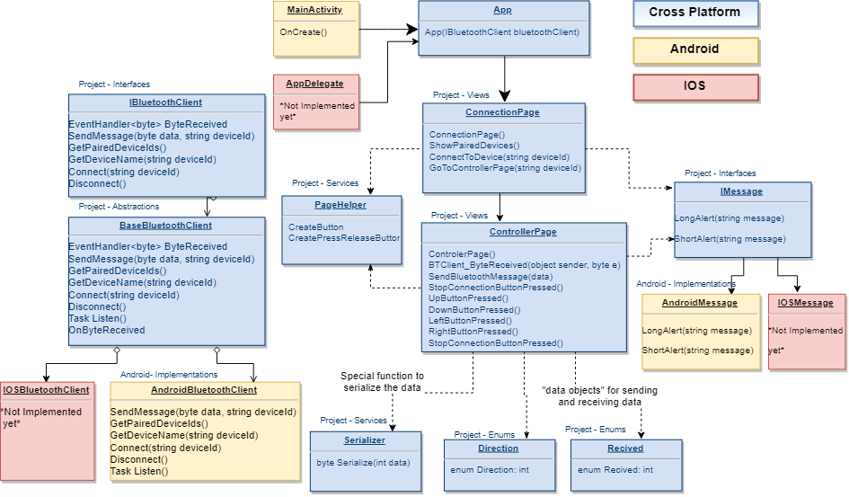
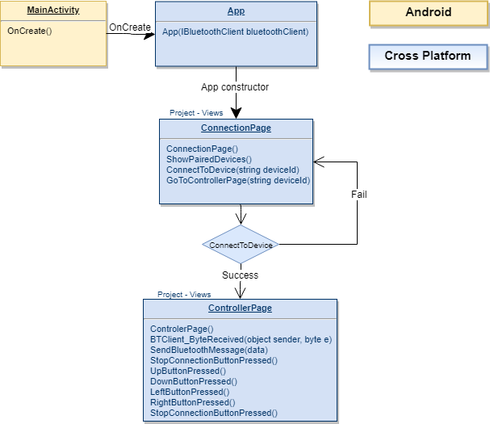
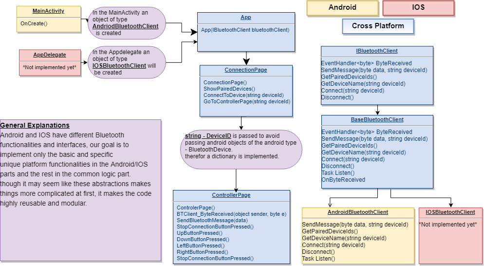
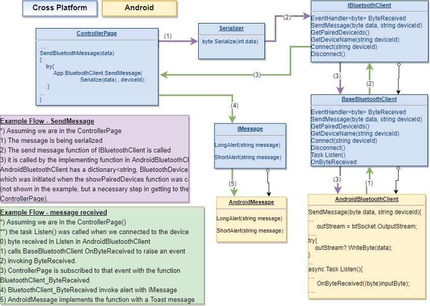

# Xamarin.Forms-to-Arduino-over-Bluetooth
A complete mobile cross-platform Xamarin app architecture with basic Bluetooth implementations Bluetooth communication.

Notes:
This code is meant as a bootstrap for fast start-up, it is by no means ideally written and is supposed to be edited according to you're individual project.
I wrote and used this project to communicate with Arduino microcontroller over Bluetooth. Since the architecture is generic the code can easily be edited and used for any type of Bluetooth communication (mobile-mobile, for example).
The tutorial will show and demonstrate the architectural guidelines and provide a fast start-up code for the mobile application.

Each platform has specific Interfaces and implementations for Bluetooth communication, therefore, in order to achieve flexible and reusable code, I chose an OOP design.

The entire project architecture:
 

Let's go over the diagram and I'll explain what we see.

The Blue square are the parts of the program which are in the common logic, thus, they don't have or need any domain-specific functionalities. The yellow squares are the Android-specific parts of the code and in red the IOS(currently not implemented).
On the upper left corner, we have the name of the directory.
The arrows represent hierarchy levels, inheritance or "flow".

As the diagram shows, most of the code is implemented in the shared logic part of the project(Blue squares). Whereas the android has only the MainActivity(only a couple lines of code added to this part of the code), and the AndroidBluetoothClient in which the implementing for the domain-specific communication is implemented, which is a "Xamariny" implementation.

For simplicity and convenience, the explanation of the project will be divided into two parts - the "Bluetooth part" and the "usage/application part".

# General Usage Overview
In the "application/usage part" we have two pages - "ConnectionPage" and "ControllerPage".
The "ConnectionPage" is the first page of the application, allowing you choose the device(from you're paired devices) and you may connect to it if the connection is succeeded you move on to the ControllerPage.
In the "ControllerPage" a connection has already been established. Therefore, the app is listening to incoming messages(if a message is received a toast will be shown on the screen) and you may send messages.
Now have an understanding of the Basic flow:

 

# The Bluetooth Part
In the "Bluetooth part" we have AndroidBluetoothClient which is a class with Android domain-specific implementations for - connect, send a message, Listen task for receiving messages. All of those and some additional Bluetooth functionalities are derived from the base class BaseBluetoothClient, which includes additional common Bluetooth implementations. BaseBluetoothlient inherits from the interface IBluetoothClient(explanation for the necessity of BaseBluetoothClient will be provided later).

 

In a nutshell, let's look at the properties and some functions of AndroidBluetoothClient.

   deviceIdToBluetoothDevice - a map from deviceName to BluetoothDevice which is an Android object. We don't want to have                                    Android objects in the common logic, so a map from name to a device is a reasonable choice.

myBluetoothAdapter - this can be thought of as the wrapper for the actual Bluetooth hardware

btSocket - is "the connection itself"

inputStream, outputStream - as you can see these are properties of the btSocket(BTW creating separate variables for them is bad                                      practice but it helps explain the code)

myUUID - the "mac address" of the device
   
List<string> GetPairedDeviceIds() - this function will initiates the dictionary *with the bond devices* mapping string to                                                      BluetoothDevice

Listen() - is a "endless loop function" that basic listens to the inputstream and if something comes up - calls a "common logic                     function" - OnByteReceived((byte)inputByte) -  to raise the event
 
   Connect(string deviceId) - most of the function is self-explanatory, but if you look closely, when we use a task for Listen().
                              the reason to do so is that Listen() is an "endless loop function", and we want it to be. we want to listen constantly for incoming messages, but we also want the screen to "endlessly listen" to us touching the screen. This is exactly what tasks solve, and the reason for doing so here.

Now let's look at BaseBluetoothClient

void OnByteReceived(byte receivedByte) - this function raises the event(reminder: called by Listen())

*additional note* - OnByteReceived is the reason we couldn't just have an interface and an implementation for the Bluetooth client. We want a "common logic function" to raise the event, which needs to be implemented.

IBluetoothClient is self-explanatory from here I hope.

# The Clever Shtik
Now that we have all the Bluetooth taken apart and generalized, we are ready to use it. We'll so by using a very fancy shtik, falling under the category of Design Patterns, called "Dependency Injection". In this case, it only means that we pass the created derived object(AndroidBluetoothClient created in the MainActivity) and pass the interface(the App constructor gets an IBluetoothClient object). By doing so, the code stays unnecessary dependent on domain-specific implementations.
Additional diagrams are supplied for your convenience. I recommend going over them slowly with the code.

Bluetooth further explanation:
 

Whole program - send and receive flow example:
 

